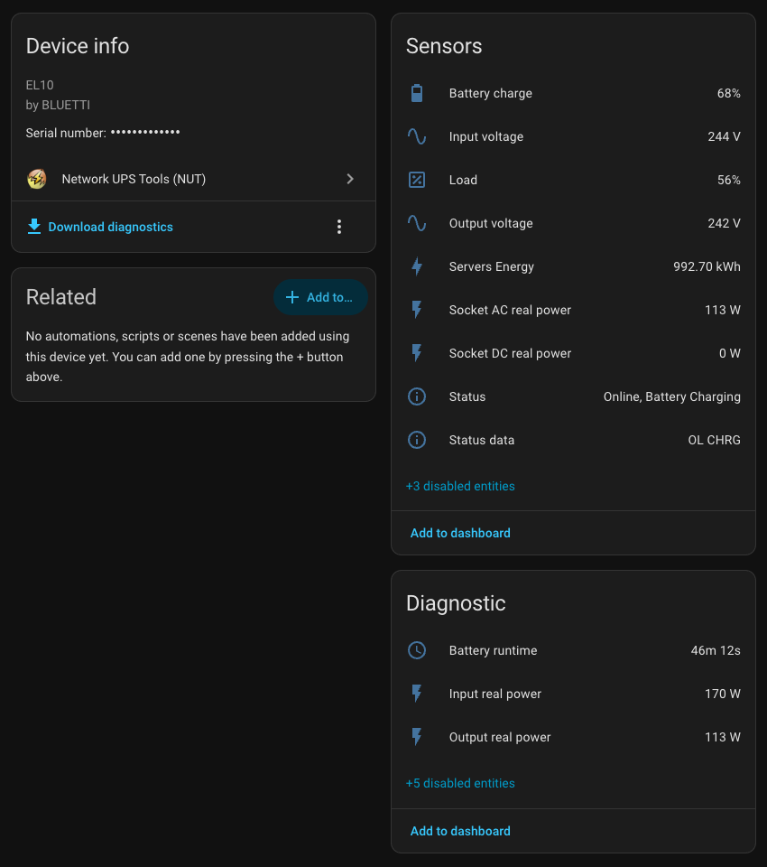
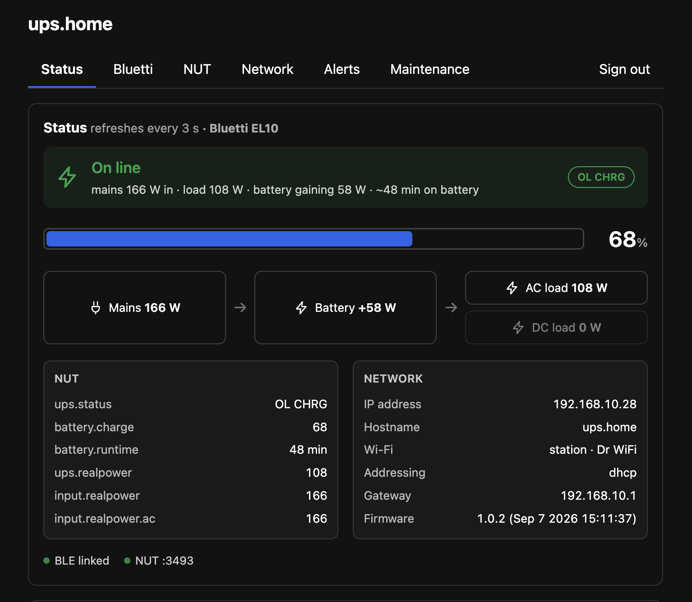
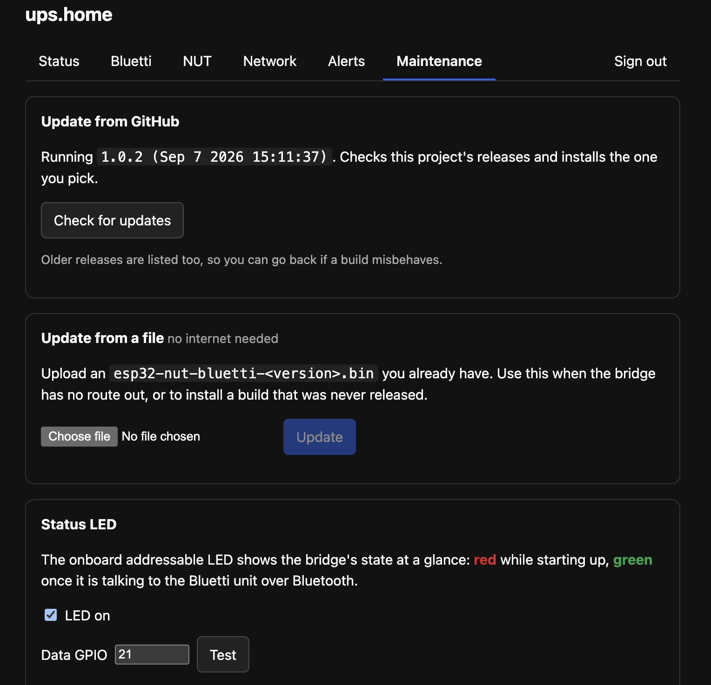

# esp32-nut-bluetti

Turns a **Bluetti** portable power station into a **NUT** (Network UPS Tools)
UPS on your network, using an ESP32 as a Bluetooth-to-Wi-Fi bridge.

Point your NAS, server or Raspberry Pi's `upsmon` at the ESP32 on port `3493`
and it sees the Bluetti as a normal UPS — on-battery / on-line status, charge,
runtime — so hosts shut down cleanly when the mains fails.

```
 ┌───────────┐   BLE    ┌─────────┐   TCP/3493 (NUT)   ┌──────────────┐
 │  Bluetti  │ ───────► │  ESP32  │ ─────────────────► │ upsmon /     │
 │  station  │ ◄─────── │         │ ◄───────────────── │ upsc clients │
 └───────────┘          └─────────┘                    └──────────────┘
```

No cloud, no account, no pairing — the BLE handshake uses fixed keys from the
vendor app. Everything is configured from a web page on the device.

## Supported models

| | Models |
| --- | --- |
| ✅ **Verified on hardware** | **Elite 10 Mini** (`EL10`) — full telemetry, confirmed against a real unit |
| 🟡 **Should be identical** | `EL100V2` — same register map upstream, untested |
| 🟡 **Partial, untested** | `AC70` `AC180` `EL30V2` `AC60` `AC60P` `AC180P` `AC2P` `Handsfree 2` — charge + AC/DC power + controls, enough for a working UPS. Line voltage and native runtime stay off (per-model scaling differs). |
| ❌ **Not supported** | `EP600` `EP760` `EP800` `EP2000` (grid/PV systems) · `AC200M` `AC300` `AC500` `EB3A` `EP500` and other **V1**-protocol units |

The model is read from the unit (register 110), not configured. An unrecognised
V2 unit falls back to charge + power.

Everything but the Elite 10 Mini is a port of
[`bluetti-bt-lib`](https://github.com/Patrick762/bluetti-bt-lib)'s field
definitions that has never run on that hardware. **Got another model?** Set the
log level to **Verbose** and send a poll capture — it dumps every register and
its value, which is what's needed to confirm the map.

## Flash it

1. Download `esp32-nut-bluetti-<version>-factory.bin` from the
   [latest release](https://github.com/thatguy-za/esp32-nut-bluetti/releases).
2. Open **[web.esphome.io](https://web.esphome.io)** in Chrome, Edge or Opera,
   plug in an **ESP32-S3 (≥4 MB flash)**, *Connect*, and pick that file.

Only the first flash needs a cable — after that, updates come from the admin
page. Offline / Linux / `esptool` steps: [`dist/FLASHING.md`](dist/FLASHING.md).

## Set it up

1. **Join the setup Wi-Fi.** The device brings up an open AP,
   `esp-nut-bluetti-XXXX`. It should open the setup page automatically;
   otherwise browse to `http://192.168.4.1/`. Give it your Wi-Fi, then set an
   admin username and password.
2. **Pick your unit.** On the bridge's page, **Bluetti** tab → *Scan for
   devices* → choose yours.
3. **Set the NUT bits.** UPS name, low-battery %, continuous AC rating. Save.

Full walkthrough: [`docs/CONFIGURING.md`](docs/CONFIGURING.md).

## Use it

```bash
upsc -l <device-ip>          # lists the UPS name (default: bluetti)
upsc bluetti@<device-ip>     # dumps every variable
```

`upsmon.conf`:

```
MONITOR bluetti@<device-ip> 1 upsmon <password> slave
```

Home Assistant, Synology, TrueNAS and anything else that speaks NUT work the
same way — point them at the bridge's IP.



*Home Assistant's built-in NUT integration, pointed at the bridge — no custom
component needed.*

## The web UI

Served from the ESP32 itself. **Status** shows the live power flow — where the
watts are coming from, where they're going, and what the battery is doing —
plus the NUT variables your clients see:



**Maintenance** handles updates over the air — pick a GitHub release, or upload
a `.bin` when the bridge has no route out:



## What you get

- **NUT server** — upsd-compatible, read-only, with an optional login gating
  `LOGIN`/`PRIMARY` the way upsd does.
- **Web admin** — live power flow, logs, config, all on the device.
- **Over-the-air updates** — pick a GitHub release from the Maintenance tab, or
  upload a `.bin`. Spare-slot write with bootloader rollback.
- **Telegram alerts** — mains lost/restored, battery low, unit unreachable.
- **Device controls** — AC/DC output, ECO modes, charging mode and more from
  the web page. Off by default; NUT stays read-only.
- **Static IP or DHCP**, settable hostname, status LED support.

## Docs

| | |
| --- | --- |
| [`docs/CONFIGURING.md`](docs/CONFIGURING.md) | Setup walkthrough, admin page, device controls, alerts, full NUT variable list, source layout, building |
| [`docs/PROTOCOL.md`](docs/PROTOCOL.md) | The Bluetti BLE protocol — handshake, framing, register map |
| [`dist/FLASHING.md`](dist/FLASHING.md) | Flashing without the web installer |

## Security

There is **no TLS** on either port. The admin password and its session cookie
cross the network in clear, and NUT reads are anonymous by design. This keeps
casual users on your LAN out of the admin page; it is not protection against
someone capturing traffic. **Keep the bridge on a trusted network and don't
expose it to the internet.**

Passwords are stored only as salted SHA-256 and compared in constant time.
Forgot it, or set an unreachable static IP? Hold BOOT through a reset to wipe
the config and return to the setup AP.

## Credits

The Bluetti BLE implementation is a C port of
[`Patrick762/bluetti-bt-lib`](https://github.com/Patrick762/bluetti-bt-lib) —
the library behind the Home Assistant integration — which builds on
[`warhammerkid/bluetti_mqtt`](https://github.com/warhammerkid/bluetti_mqtt).

## License

MIT — see [`LICENSE`](LICENSE). Not affiliated with or endorsed by BLUETTI.
